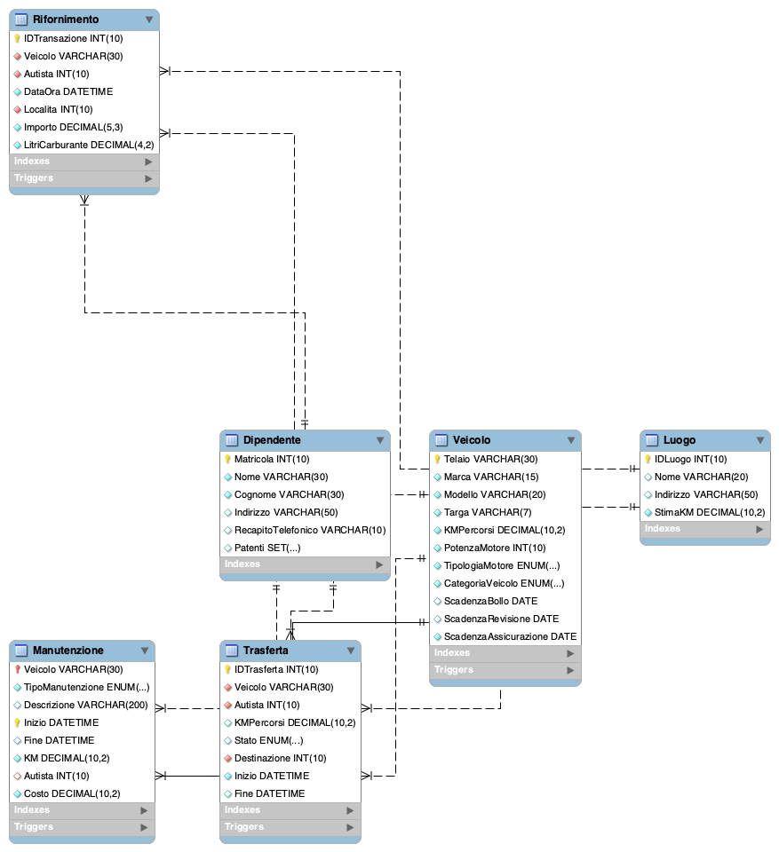

# Progetto-Database
Sviluppo di un sistema per la gestione di una flotta di veicoli

## Requisiti
- Informazioni su veicoli
- Manutenzione
- Guidatori
- Itinerari
- Monitoraggio del carburante
- Monitoraggio delle manutenzioni

